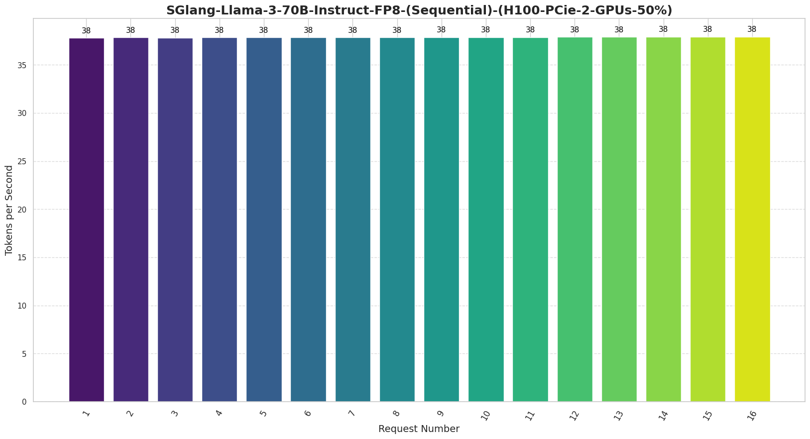
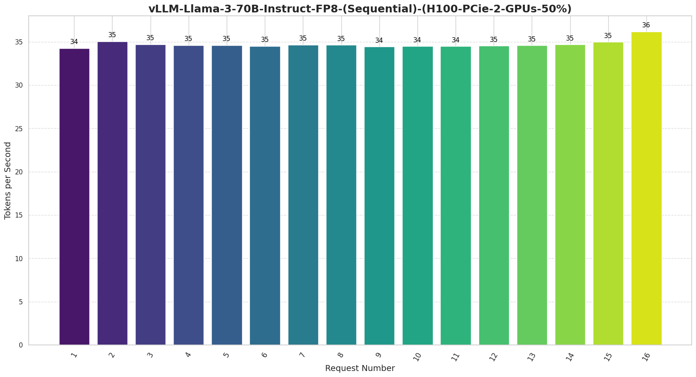
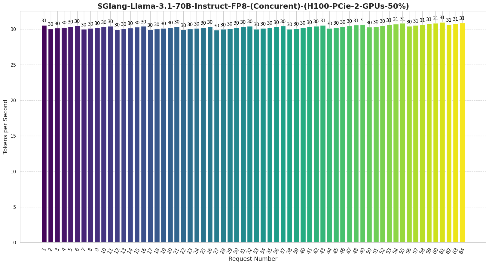
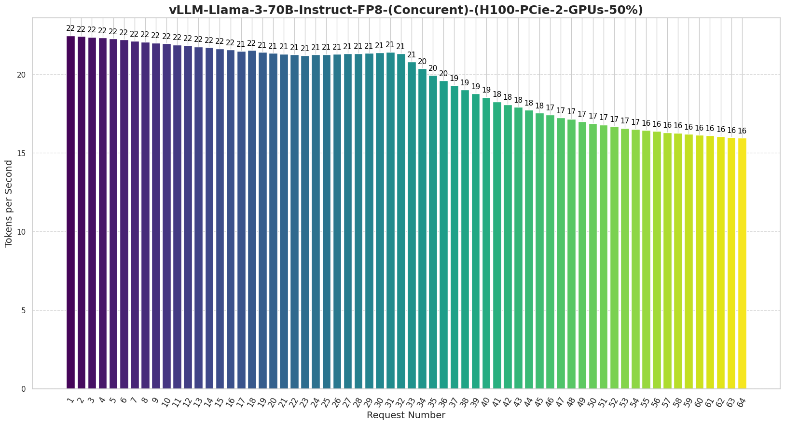
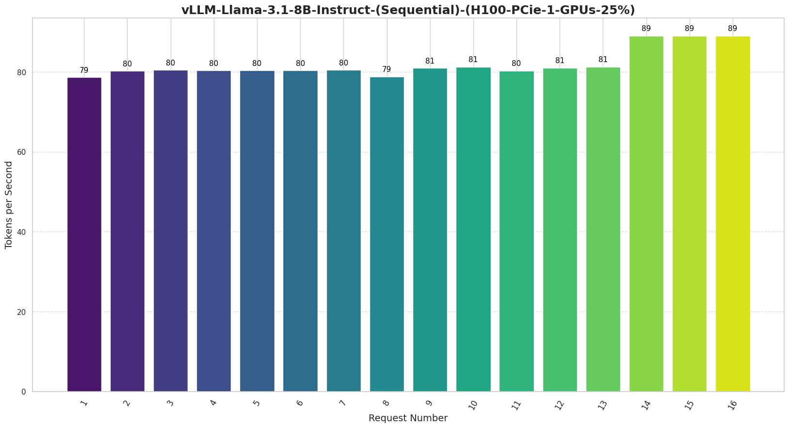
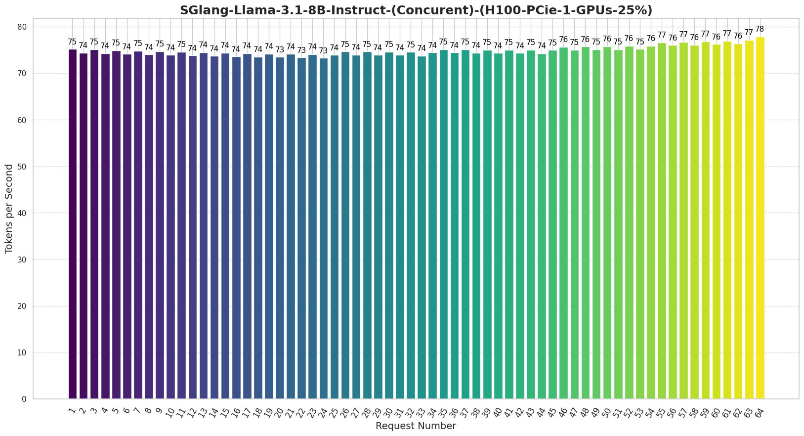
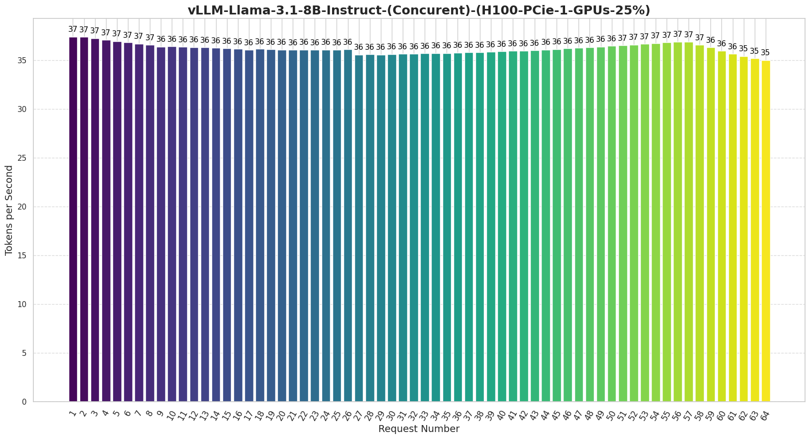

# Project: LLM Inference Engine Performance Testing

## Overview

This project contains a set of Python scripts designed to test and compare the performance of various LLM inference engines, including SGLang, vLLM, Groq, and OpenAI. The results are recorded and plotted for analysis.

## Directory Structure

```plaintext
📦scripts
 ┣ 📜graph-plot.py
 ┣ 📜sglang-concurent.py
 ┣ 📜sglang-sequential.py
 ┣ 📜vLLM-concurent.py
 ┗ 📜vLLM-sequential.py
```

### Files

1. **sglang or vLLM-sequential.py**:
    - Sends requests to the LLM inference engine sequentially.
    - Records the time taken for each request, the number of prompt tokens, generated tokens, and tokens per second.
    - Outputs results to `results.csv`.

2. **sglang or vLLM-concurent.py**:
    - Sends requests to the LLM inference engine concurrently.
    - Uses threading to manage multiple simultaneous requests.
    - Records the same performance metrics as the sequential script.
    - Outputs results to `results.csv`.

3. **graph-plot.py**:
    - Reads the `results.csv` file generated by the other scripts.
    - Plots a bar chart of tokens generated per second for each request.
    - Saves the plot as a PNG image in the `images` directory.

## Usage

### 1. Sequential Requests

Run the `sglang-sequential.py` script to send a specified number of requests sequentially to the LLM inference engine and record the results.

```bash
python sglang-sequential.py
```

### 2. Concurrent Requests

Run the `sglang-concurent.py` script to send a specified number of requests concurrently to the LLM inference engine and record the results.

```bash
python sglang-concurent.py
```

### 3. Plotting the Results

After running either the sequential or concurrent script, use the `graph-plot.py` script to generate a plot of the tokens generated per second.

```bash
python graph-plot.py
```
## Sequential vs. Concurrent Requests

### Sequential Requests

In the sequential approach, requests are sent one after another, with a delay between each request. This method ensures that only one request is processed at a time, which can be useful for understanding the performance of individual requests without interference from others.

#### Example of Calculated Delay Time

If you have `num_requests = 5`, the delays between each request will be as follows:

- Request 1: sent at time `t = 0s`
- Request 2: sent at time `t = 2s`
- Request 3: sent at time `t = 4s`
- Request 4: sent at time `t = 6s`
- Request 5: sent at time `t = 8s`

```python
def send_request_sequentially(num_requests):
    for request_number in range(1, num_requests + 1):
        messages = [
            {"role": "user", "content": "Write a long essay on the topic of spring."}
        ]
        chat_completion_request_groq(messages, client, request_number)
        time.sleep(2)  # Wait for 2 seconds before sending the next request
```

### Concurrent Requests

In the concurrent approach, multiple requests are sent almost simultaneously, with a slight delay between the start times of each request to avoid overwhelming the system all at once. This method uses threading to handle multiple requests in parallel, which can help test the system's performance under load and its ability to handle concurrent processing.

#### Example of Concurrent Requests

If you have `num_requests = 5` with a delay of `0.06125` seconds between each request, the delays will be as follows:

- Request 1: sent at time `t = 0s`
- Request 2: sent at time `t = 0.06125s`
- Request 3: sent at time `t = 0.1225s`
- Request 4: sent at time `t = 0.18375s`
- Request 5: sent at time `t = 0.245s`

```python
def send_request_every_x_seconds(num_requests):
    for i in range(num_requests):
        threading.Timer(0.06125 * i, send_request, args=(i + 1,)).start()
```

## Perfomance test Results
<h3 align="center">Llama3-70B-FP8 (Sequential Request)</h3>
<p align="center">
  <div style="display: inline-block; text-align: center; width: 45%;">
    <p><strong>SGlang</strong></p>
    
  </div>
  <div style="display: inline-block; text-align: center; width: 45%;">
    <p><strong>vLLM</strong></p>
    
  </div>
</p>
<p align="center"><em>SGLang shows slightly higher performance for sequential requests, achieving 38 tokens per second, compared to vLLM’s 35 tokens per second. This suggests that SGLang is more efficient in processing requests individually. Both engines demonstrate consistent performance across multiple requests, but SGLang has a clear edge in throughput.</em></p>

<h3 align="center">Llama3-70B-FP8 (Concurrent Request)</h3>
<p align="center">
  <div style="display: inline-block; text-align: center; width: 45%;">
    <p><strong>SGlang</strong></p>
    
  </div>
  <div style="display: inline-block; text-align: center; width: 45%;">
    <p><strong>vLLM</strong></p>
    
  </div>
</p>
<p align="center"><em>SGLang maintains a stable performance, consistently processing 30-31 tokens per second across all requests, demonstrating its efficiency and resilience under load. In contrast, vLLM shows a noticeable decline in performance as the number of requests increases, starting at 22 tokens per second and dropping to 16 tokens per second. This suggests that SGLang is better suited for handling high concurrency, providing more reliable throughput under heavy workloads.</em></p>

<h3 align="center">Llama3.1-8B (Sequential Request)</h3>
<p align="center">
  <div style="display: inline-block; text-align: center; width: 45%;">
    <p><strong>SGlang</strong></p>
    
  </div>
  <div style="display: inline-block; text-align: center; width: 45%;">
    <p><strong>vLLM</strong></p>
    
  </div>
</p>
<p align="center"><em>Both engines demonstrate high and consistent performance. SGLang processes requests at around 91 tokens per second, while vLLM handles them at 80 tokens per second. SGLang exhibits slightly better throughput, suggesting it can handle individual requests more efficiently compared to vLLM under these conditions.</em></p>

<h3 align="center">Llama3.1-8B (Concurrent Request)</h3>
<p align="center">
  <div style="display: inline-block; text-align: center; width: 45%;">
    <p><strong>SGlang</strong></p>
    
  </div>
  <div style="display: inline-block; text-align: center; width: 45%;">
    <p><strong>vLLM</strong></p>
    
  </div>
</p>
<p align="center"><em>SGLang maintains a steady performance, consistently processing around 75-78 tokens per second, showcasing its robust handling of high-concurrency workloads. In contrast, vLLM starts at 37 tokens per second but gradually decreases to around 35 tokens per second, highlighting a significant performance gap. This suggests that SGLang delivers nearly double the throughput compared to vLLM under concurrent request conditions, making it a more efficient choice for scenarios requiring high concurrency.</em></p>


## Contact

For any questions or issues, please contact [Chirawat Chitpakdee](mailto:chirawat.ch@ku.th).